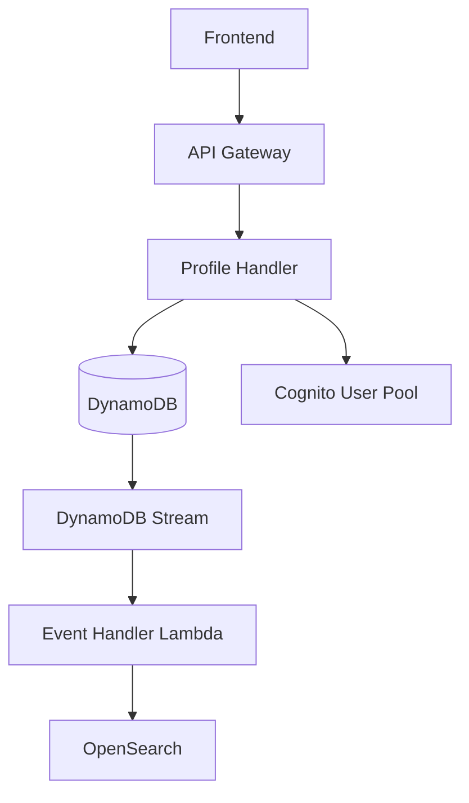
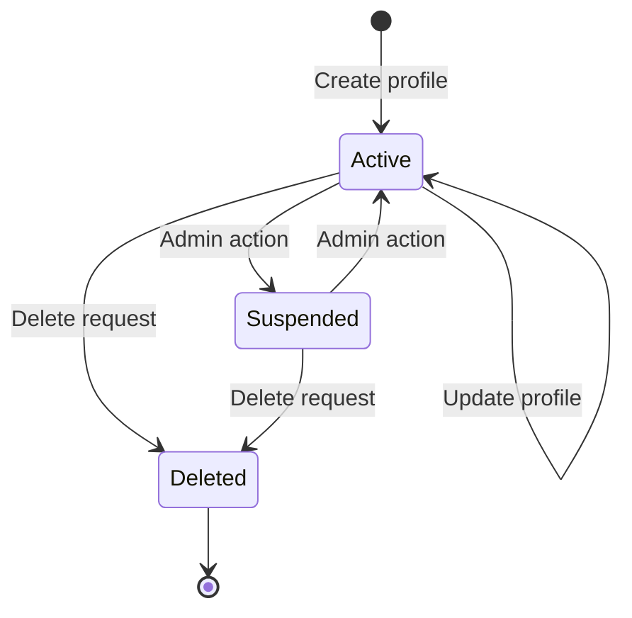

# Engineering Design Document Template

## What is an EDD?

An **Engineering Design Document (EDD)** is a detailed implementation specification that describes **how** a feature or system will be built. Unlike RFCs (which propose architectural decisions) or ADRs (which record decisions), EDDs focus on the concrete implementation details.

### Document Hierarchy

```
ADR (Architecture Decision Record)
 └── Records a single architectural decision
 └── Answers: "What did we decide and why?"
 └── Example: "Use DynamoDB as our primary database"

RFC (Request for Comments)
 └── Proposes a system or architectural direction
 └── Answers: "What should we build and what approach should we take?"
 └── Example: "Serverless Foundation Template"
 └── References ADRs for underlying decisions

EDD (Engineering Design Document)
 └── Specifies how to implement a feature
 └── Answers: "How exactly will this be built?"
 └── Example: "User Profile Management Feature"
 └── Assumes ADRs/RFCs are already approved
```

### When to Write an EDD

Write an EDD when:

- Implementing a new feature that spans multiple components
- Building something with complex data flows or state management
- The implementation requires coordination across teams
- You need to validate implementation details before coding
- The feature has non-obvious edge cases or error handling

Skip the EDD when:

- The implementation is straightforward CRUD
- Following existing patterns with no deviations
- The change is isolated to a single file
- Bug fixes with obvious solutions

### EDD vs RFC

| Aspect    | RFC                         | EDD                        |
| --------- | --------------------------- | -------------------------- |
| Purpose   | Propose direction           | Specify implementation     |
| Scope     | System/architecture         | Feature/component          |
| Decisions | Makes architectural choices | Assumes decisions are made |
| Approval  | Requires stakeholder buy-in | Technical review           |
| Output    | ADRs, approved direction    | Implementation spec        |
| Audience  | Architects, leadership      | Engineers implementing     |

---

# EDD: [Feature Name]

| Field        | Value                                      |
| ------------ | ------------------------------------------ |
| Author       | [Name]                                     |
| Status       | Draft / In Review / Approved / Implemented |
| Created      | YYYY-MM-DD                                 |
| Updated      | YYYY-MM-DD                                 |
| Related ADRs | [ADR-XXX](../ADR/XXX-title.md)             |

## Summary

One paragraph describing what this EDD covers. Focus on the implementation scope, not the business rationale.

## Prerequisites

List the architectural decisions and existing systems this EDD builds upon:

- [ADR-XXX: Relevant Decision](../ADR/XXX-title.md)
- Existing component/service this depends on

## Data Model

Define the exact data structures, schemas, and entities involved.

### Entity Definitions

```typescript
// TypeSpec or TypeScript definition
model UserProfile {
  @key
  userId: UUID;

  displayName: DisplayName;
  email: Email;
  preferences: UserPreferences;

  @createdAt
  createdAt: int64;

  @updatedAt
  updatedAt: int64;
}

model UserPreferences {
  theme: Theme;
  notifications: NotificationSettings;
  locale: string;
}
```

### DynamoDB Access Patterns

| Access Pattern             | Index   | PK                 | SK               | Operation |
| -------------------------- | ------- | ------------------ | ---------------- | --------- |
| Get user by ID             | Primary | `USER#${userId}`   | `PROFILE`        | GetItem   |
| List users by email domain | GSI1    | `DOMAIN#${domain}` | `USER#${userId}` | Query     |

## API Design

### Endpoints

| Method | Path                      | Operation ID        | Description           |
| ------ | ------------------------- | ------------------- | --------------------- |
| GET    | `/users/{userId}/profile` | `getUserProfile`    | Retrieve user profile |
| PUT    | `/users/{userId}/profile` | `updateUserProfile` | Update user profile   |
| DELETE | `/users/{userId}/profile` | `deleteUserProfile` | Delete user profile   |

### Request/Response Examples

```typescript
// GET /users/{userId}/profile
// Response 200
{
  "userId": "abc123...",
  "displayName": "John Doe",
  "email": "john@example.com",
  "preferences": {
    "theme": "dark",
    "notifications": { "email": true, "push": false },
    "locale": "en-US"
  },
  "createdAt": 1704067200000,
  "updatedAt": 1704153600000
}
```

## Component Architecture



## Implementation Details

### Handler Logic

Describe the specific logic for each handler:

```typescript
// handlers/get-user-profile.ts
export const getUserProfile: Handler = async (c, event) => {
  const { userId } = c.request.params;

  // 1. Validate caller has access to this profile
  const callerId = event.requestContext.authorizer.claims.sub;
  if (callerId !== userId && !isAdmin(callerId)) {
    return forbidden("Cannot access other user profiles");
  }

  // 2. Fetch profile from DynamoDB
  const profile = await UserProfileEntity.get({ userId }).go();

  if (!profile.data) {
    return notFound("Profile not found");
  }

  // 3. Return profile
  return ok(profile.data);
};
```

### Error Handling

| Error Condition     | HTTP Status | Error Code          | User Message                 |
| ------------------- | ----------- | ------------------- | ---------------------------- |
| Profile not found   | 404         | `PROFILE_NOT_FOUND` | "Profile not found"          |
| Unauthorized access | 403         | `ACCESS_DENIED`     | "Cannot access this profile" |
| Invalid input       | 400         | `VALIDATION_ERROR`  | Field-specific messages      |

### Validation Rules

| Field         | Rule               | Error Message                          |
| ------------- | ------------------ | -------------------------------------- |
| `displayName` | 3-48 characters    | "Display name must be 3-48 characters" |
| `email`       | Valid email format | "Invalid email format"                 |
| `locale`      | ISO 639-1 code     | "Invalid locale code"                  |

## State Transitions

If the feature involves state management:



## Testing Strategy

### Unit Tests

- Handler logic with mocked DynamoDB
- Validation rules
- Authorization checks

### Integration Tests

- End-to-end API calls against local DynamoDB
- Stream processing with test events

### Test Cases

| Test Case                 | Input                          | Expected Output       |
| ------------------------- | ------------------------------ | --------------------- |
| Get own profile           | Valid userId, matching caller  | 200, profile data     |
| Get other's profile       | Valid userId, different caller | 403                   |
| Update with invalid email | Invalid email format           | 400, validation error |

## Rollout Plan

1. **Phase 1**: Deploy to dev environment
   - Verify all endpoints work
   - Test error handling

2. **Phase 2**: Deploy to alpha
   - Load testing
   - Monitor CloudWatch metrics

3. **Phase 3**: Production deployment
   - Canary deployment (10% traffic)
   - Monitor error rates
   - Full rollout

## Open Questions

List any implementation details still being decided:

- [ ] Should we cache profiles in ElastiCache?
- [ ] What is the retention policy for deleted profiles?

## Appendix

### Related Documentation

- [RFC-001: Serverless Foundation Template](./001_Serverless_Foundation_Template.md)
- [API Documentation](link-to-api-docs)

### Glossary

| Term        | Definition                             |
| ----------- | -------------------------------------- |
| Profile     | User-editable account information      |
| Preferences | User settings for UI and notifications |
