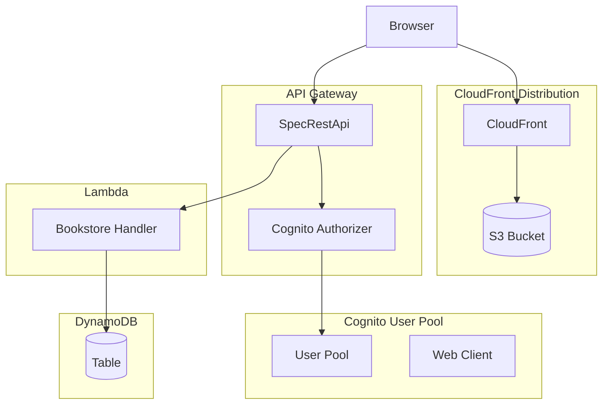
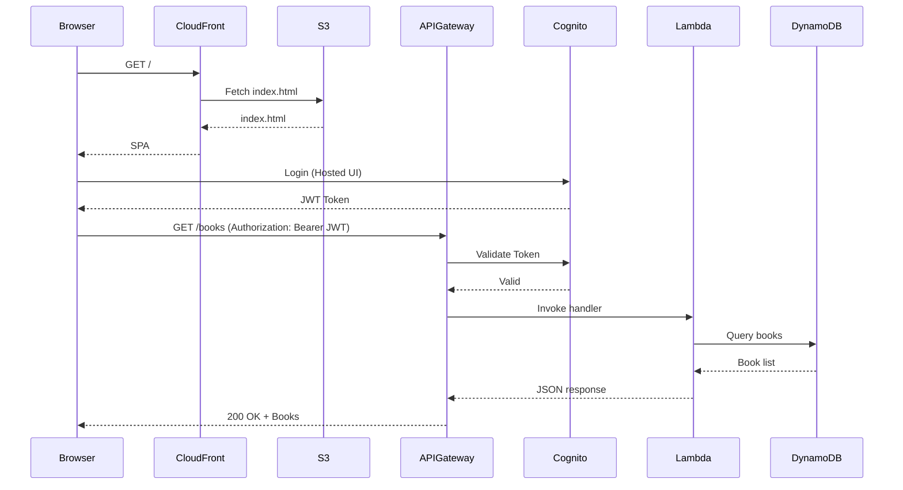

# EDD: Reference CDK Infrastructure

| Field   | Value      |
| ------- | ---------- |
| Author  | Claude     |
| Status  | Draft      |
| Created | 2026-01-23 |
| Updated | 2026-01-23 |

## Summary

This EDD specifies a minimal reference CDK infrastructure demonstrating the core serverless pattern: API Gateway backed by Lambda with Cognito authentication, serving a React frontend via CloudFront. The implementation uses a single stack, single account, single stage approach for simplicity.

## Prerequisites

- Existing bookstore-backend Lambda handler (`packages/bookstore-backend/`)
- Existing bookstore-ddb-service with ElectroDB entities (`packages/bookstore-ddb-service/`)
- Generated OpenAPI spec from TypeSpec (`build/bookstore-openapi3/`)
- Cognito authorizer defined in TypeSpec (`typespec/lib/cognito-auth.tsp`)

## Component Architecture



## CDK Architecture

### Directory Structure

```
src/
├── app/
│   └── bookstore.ts              # CDK app entry point
├── config/
│   └── main.ts                   # Stage configuration
├── lib/
│   └── format.ts                 # Naming conventions
├── constructs/
│   ├── apigateway/
│   │   └── openapi.ts            # OpenAPI-based API Gateway
│   ├── cognito/
│   │   └── userpool.ts           # Cognito User Pool
│   ├── dynamodb/
│   │   └── table.ts              # DynamoDB TableV2
│   └── lambda/
│       └── nodejs-arm-lambda.ts  # ARM64 Lambda function
└── stacks/
    └── bookstore/
        └── bookstore-stack.ts    # Single unified stack
```

### Single Stack Approach

For this reference implementation, all resources are consolidated into a single stack. This simplifies deployment and demonstrates the core patterns without the complexity of multi-stack dependencies.

```typescript
// src/stacks/bookstore/bookstore-stack.ts
interface BookstoreStackProps extends StackProps {
  stageName: string;
}

export class BookstoreStack extends Stack {
  constructor(scope: Construct, id: string, props: BookstoreStackProps) {
    super(scope, id, props);

    const { stageName } = props;

    // 1. DynamoDB Table
    const table = new DynamoDBTableV2(this, "Table", {
      tableName: formatTableName({ stageName }),
    });

    // 2. Cognito User Pool
    const { userPool } = this.createUserPool(stageName);

    // 3. Lambda Handler
    const handler = this.createHandler(stageName, table);

    // 4. API Gateway
    this.createApiGateway(stageName, handler, userPool);

    // 5. CloudFront + S3
    this.createFrontend(stageName);
  }
}
```

## Implementation Details

### 1. DynamoDB Table

Reuse the `DynamoDBTableV2` construct with standardized key schema:

```typescript
// src/constructs/dynamodb/table.ts
export class DynamoDBTableV2 extends TableV2 {
  constructor(scope: Construct, id: string, props: DynamoDBTableV2Props) {
    super(scope, id, {
      tableName: props.tableName,
      partitionKey: { name: "pk", type: AttributeType.STRING },
      sortKey: { name: "sk", type: AttributeType.STRING },
      billing: Billing.onDemand(),
      removalPolicy: RemovalPolicy.RETAIN,
      pointInTimeRecoverySpecification: {
        pointInTimeRecoveryEnabled: true,
      },
    });
  }

  public addGlobalIndex() {
    const index = this.globalSecondaryIndexCount++;
    this.addGlobalSecondaryIndex({
      partitionKey: { name: `gsi${index}pk`, type: AttributeType.STRING },
      sortKey: { name: `gsi${index}sk`, type: AttributeType.STRING },
      indexName: `gsi${index}`,
    });
  }
}
```

### 2. Cognito User Pool

Simplified user pool without federated identity (EntraID). Uses Cognito-hosted UI for authentication:

```typescript
// src/constructs/cognito/userpool.ts
export class BookstoreUserPool extends Construct {
  public readonly userPool: UserPool;
  public readonly webClient: UserPoolClient;

  constructor(scope: Construct, id: string, props: BookstoreUserPoolProps) {
    super(scope, id);

    const { stageName, callbackUrls, logoutUrls } = props;

    this.userPool = new UserPool(this, "UserPool", {
      userPoolName: `${stageName}-bookstore-users`,
      selfSignUpEnabled: true,
      signInAliases: { email: true },
      autoVerify: { email: true },
      removalPolicy: RemovalPolicy.DESTROY,
    });

    this.userPool.addDomain("CognitoDomain", {
      cognitoDomain: {
        domainPrefix: `${stageName}-bookstore`,
      },
    });

    this.webClient = this.userPool.addClient("WebClient", {
      userPoolClientName: "webClient",
      oAuth: {
        flows: { authorizationCodeGrant: true },
        scopes: [OAuthScope.OPENID, OAuthScope.EMAIL, OAuthScope.PROFILE],
        callbackUrls,
        logoutUrls,
      },
      supportedIdentityProviders: [UserPoolClientIdentityProvider.COGNITO],
    });
  }
}
```

### 3. Lambda Handler

ARM64 Lambda with standardized configuration:

```typescript
// src/constructs/lambda/nodejs-arm-lambda.ts
export class NodeJSArmLambdaFunction extends Fn {
  constructor(scope: Construct, id: string, props: NodeJSArmLambdaProps) {
    super(scope, id, {
      ...props,
      runtime: Runtime.NODEJS_24_X,
      architecture: Architecture.ARM_64,
      memorySize: props.memorySize ?? 2048,
      timeout: props.timeout ?? Duration.seconds(10),
      loggingFormat: LoggingFormat.JSON,
      tracing: Tracing.ACTIVE,
      code:
        props.code ??
        Code.fromInline(`
        exports.handler = async () => { throw new Error("No code"); }
      `),
    });

    this.addEnvironment("NODE_OPTIONS", "--enable-source-maps");
    this.addEnvironment("NODE_ENV", "production");
  }
}
```

Handler setup in stack:

```typescript
private createHandler(stageName: string, table: DynamoDBTableV2) {
  const functionName = formatFunctionName({ stageName });

  const handler = new NodeJSArmLambdaFunction(this, "Handler", {
    functionName,
    handler: "index.handler",
  });

  table.grantReadWriteData(handler);
  handler.addEnvironment("DYNAMODB_TABLE_NAME", table.tableName);
  handler.addEnvironment("STAGE_NAME", stageName);

  return handler;
}
```

### 4. API Gateway with OpenAPI

Uses TypeSpec-generated OpenAPI spec with template variable injection:

```typescript
// src/constructs/apigateway/openapi.ts
export class APIGatewayOpenAPI extends Construct {
  readonly api: SpecRestApi;

  constructor(scope: Construct, id: string, props: APIGatewayOpenAPIProps) {
    super(scope, id);

    const { name, openApiSpec, templateVariables, handler, allowedOrigins } =
      props;

    // Inject template variables (HandlerFunctionName, CognitoUserPoolArn)
    const transformedSpec = this.injectTemplateVariables(
      openApiSpec,
      templateVariables,
    );

    // Inject CORS OPTIONS handlers
    if (allowedOrigins.length > 0) {
      injectCorsOptionsHandlers({
        allowedOrigins,
        openApiSpec: transformedSpec,
      });
    }

    const accessLogGroup = new LogGroup(this, "AccessLogGroup", {
      logGroupName: `/aws/apigateway/${name}`,
      retention: RetentionDays.ONE_MONTH,
    });

    this.api = new SpecRestApi(this, "SpecRestApi", {
      restApiName: name,
      apiDefinition: ApiDefinition.fromInline(transformedSpec),
      deploy: true,
      deployOptions: {
        tracingEnabled: true,
        accessLogDestination: new LogGroupLogDestination(accessLogGroup),
      },
    });

    handler.addPermission("PermitAPIGInvocation", {
      principal: new ServicePrincipal("apigateway.amazonaws.com"),
      sourceArn: this.api.arnForExecuteApi("*"),
    });
  }
}
```

Stack integration:

```typescript
private createApiGateway(stageName: string, handler: IFunction, userPool: UserPool) {
  const allowedOrigins = [
    `https://${stageName}-bookstore.example.com`,
    "https://localhost:3000",
  ];

  new APIGatewayOpenAPI(this, "API", {
    name: `${stageName}-bookstore-api`,
    handler,
    openApiSpec: JSON.stringify(OpenAPISpec),
    allowedOrigins,
    templateVariables: {
      HandlerFunctionName: handler.functionName,
      CognitoUserPoolArn: userPool.userPoolArn,
    },
  });
}
```

### 5. CloudFront + S3 Frontend

S3 bucket with CloudFront distribution for SPA hosting:

```typescript
private createFrontend(stageName: string) {
  const websiteBucket = new Bucket(this, "WebsiteBucket", {
    bucketName: `${stageName}-bookstore-frontend`,
    removalPolicy: RemovalPolicy.DESTROY,
    autoDeleteObjects: true,
    blockPublicAccess: BlockPublicAccess.BLOCK_ALL,
    enforceSSL: true,
  });

  const originAccessIdentity = new OriginAccessIdentity(this, "OAI");

  new Distribution(this, "Distribution", {
    defaultRootObject: "index.html",
    errorResponses: [
      {
        httpStatus: 403,
        responseHttpStatus: 200,
        responsePagePath: "/index.html",
        ttl: Duration.minutes(5),
      },
    ],
    defaultBehavior: {
      origin: S3BucketOrigin.withOriginAccessIdentity(websiteBucket, {
        originAccessIdentity,
        originPath: "/public",
      }),
      compress: true,
      allowedMethods: AllowedMethods.ALLOW_GET_HEAD_OPTIONS,
      viewerProtocolPolicy: ViewerProtocolPolicy.REDIRECT_TO_HTTPS,
    },
  });
}
```

## Configuration

### Stage Configuration

```typescript
// src/config/main.ts
export default {
  aws: {
    region: "eu-central-1",
  },
  stages: [
    {
      stageName: "dev",
      account: "123456789012",
      oauth: {
        callbackUrls: ["https://localhost:3000/callback"],
        logoutUrls: ["https://localhost:3000/logout"],
      },
    },
  ],
};
```

### Naming Conventions

```typescript
// src/lib/format.ts
export const formatTableName = ({ stageName }: { stageName: string }) =>
  `${stageName}-bookstore`;

export const formatFunctionName = ({ stageName }: { stageName: string }) =>
  `${stageName}-bookstore-backend`;

export const formatBucketName = ({ stageName }: { stageName: string }) =>
  `${stageName}-bookstore-frontend`;
```

## CDK App Entry Point

```typescript
// src/app/bookstore.ts
import { App } from "aws-cdk-lib";
import config from "#config/main.js";
import { BookstoreStack } from "#stacks/bookstore/bookstore-stack.js";

const app = new App();

for (const stage of config.stages) {
  new BookstoreStack(app, `${stage.stageName}-BookstoreStack`, {
    stageName: stage.stageName,
    env: {
      account: stage.account,
      region: config.aws.region,
    },
  });
}

app.synth();
```

## Data Flow



## Implementation Phases

### Phase 1: Core Infrastructure

1. Create directory structure (`src/app/`, `src/config/`, `src/lib/`, `src/constructs/`, `src/stacks/`)
2. Create reusable constructs:
   - `NodeJSArmLambdaFunction`
   - `DynamoDBTableV2`
   - `APIGatewayOpenAPI`
3. Create `BookstoreStack` with DynamoDB and Lambda
4. Configure CDK app entry point

### Phase 2: Authentication

1. Create `BookstoreUserPool` construct
2. Integrate Cognito authorizer with API Gateway
3. Configure OAuth callback URLs

### Phase 3: Frontend Hosting

1. Add S3 bucket for static assets
2. Create CloudFront distribution
3. Configure SPA routing (403 → index.html)

### Phase 4: Deployment Pipeline (Optional)

1. Add CodePipeline for CI/CD
2. Configure cross-account deployment roles
3. Add Lambda code deployment via CodeBuild

## Key Design Decisions

| Decision                   | Rationale                                                                         |
| -------------------------- | --------------------------------------------------------------------------------- |
| Single stack               | Simplifies deployment, avoids cross-stack references for reference implementation |
| No custom domain           | Template repo; downstream repos configure their own Route53 and domain names      |
| Cognito-only auth          | No federated identity; uses Cognito Hosted UI for simplicity                      |
| RemovalPolicy.DESTROY      | Allows easy cleanup for dev/demo environments                                     |
| ARM64 Lambda               | Cost-optimized, better price-performance ratio                                    |
| On-demand DynamoDB         | No capacity planning needed for variable workloads                                |
| Co-located code deployment | Lambda code bundled in CDK pipeline; no separate application pipeline             |

## Best Practices for Production

### Separate Application Pipelines

While this reference implementation deploys Lambda code via the CDK infrastructure pipeline for simplicity (code is co-located), production deployments should consider separate application pipelines:

**Benefits of separate pipelines:**

- Faster deployments (no CDK synth/diff for code-only changes)
- Independent release cycles for infrastructure vs application code
- Reduced blast radius (application deployment doesn't touch infrastructure)
- Enables canary/blue-green deployments at the application layer

**When to use co-located deployment (this template):**

- Small teams with infrequent deployments
- Early-stage projects where infrastructure changes frequently
- Monorepo setups where code and infrastructure are tightly coupled

**When to split pipelines (production):**

- Multiple deployments per day
- Separate teams for infrastructure and application
- Need for sophisticated deployment strategies (canary, blue-green)
- Compliance requirements for change management separation

Consider implementing separate CodeBuild projects (e.g., `deploy-backend` and `deploy-frontend`) that update Lambda/CloudFront independently of infrastructure changes.
