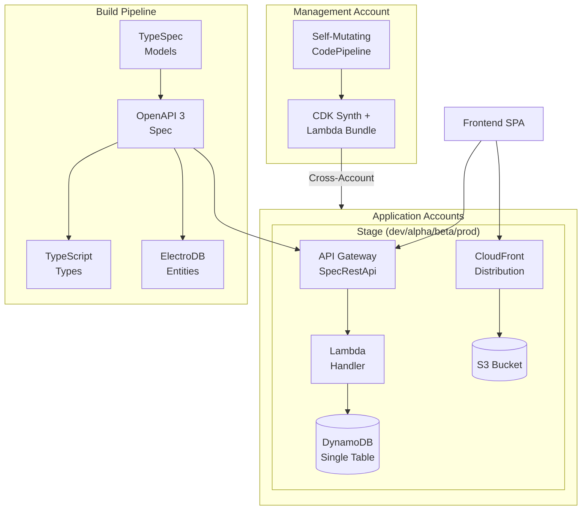
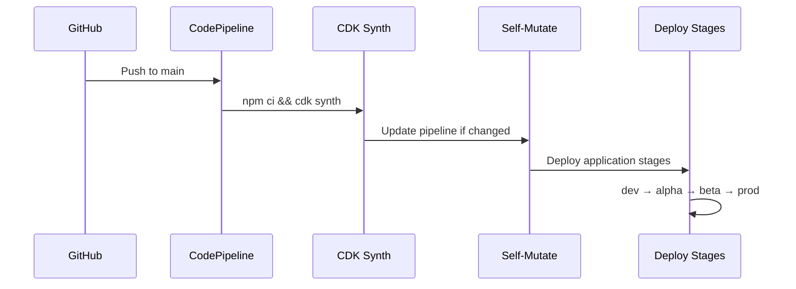
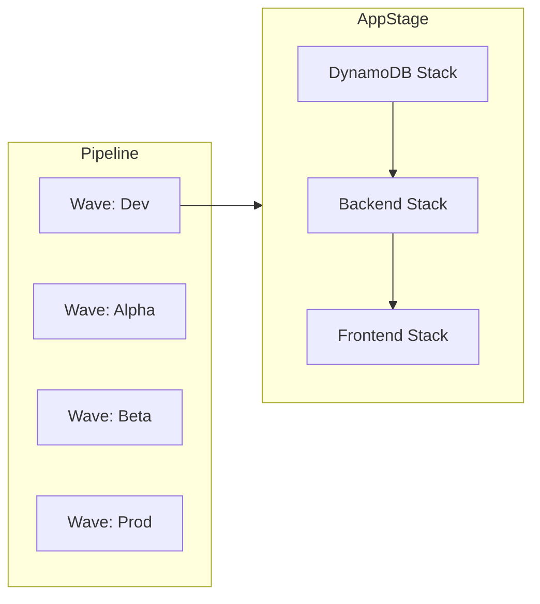
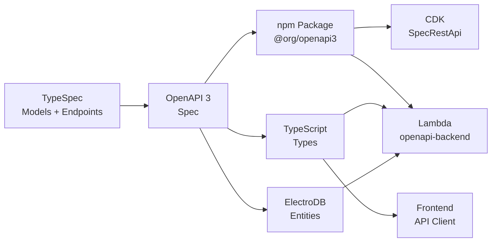
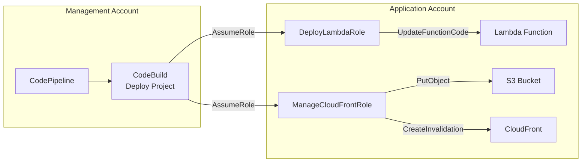

# RFC 001: Serverless Foundation Template

| Status    | Approved                                                                                                                                                                                                                                                                                                                                                                                                                                                                             |
| --------- | ------------------------------------------------------------------------------------------------------------------------------------------------------------------------------------------------------------------------------------------------------------------------------------------------------------------------------------------------------------------------------------------------------------------------------------------------------------------------------------ |
| Author    | Architecture Team                                                                                                                                                                                                                                                                                                                                                                                                                                                                    |
| Reviewers | Platform Team                                                                                                                                                                                                                                                                                                                                                                                                                                                                        |
| Created   | 2024                                                                                                                                                                                                                                                                                                                                                                                                                                                                                 |
| ADRs      | [ADR-002](../ADR/002-Model_APIs_using_typespec.md), [ADR-003](../ADR/003-Implement_infrastructure_as_code_with_AWS_CDK.md), [ADR-004](../ADR/004-Apply_multi-account_strategy.md), [ADR-005](../ADR/005-Serverless_backends.md), [ADR-006](../ADR/006-Typescript_for_webservices.md), [ADR-007](../ADR/007-API-First_and_OpenAPI-backend.md), [ADR-009](../ADR/009-Use_DynamoDB.md), [ADR-010](../ADR/010-One_infra_pipeline.md), [ADR-012](../ADR/012-Cross-account-permissions.md), [ADR-013](../ADR/013-ARM64_Lambda_architecture.md), [ADR-014](../ADR/014-Convention_over_configuration.md), [ADR-015](../ADR/015-npm_workspaces_monorepo.md), [ADR-016](../ADR/016-Biome_for_linting.md), [ADR-017](../ADR/017-S3_CloudFront_frontend_hosting.md) |

## Abstract

This RFC proposes a generalized CDK template repository providing production-ready infrastructure patterns for serverless applications on AWS. The template distills common patterns from production repositories into a reusable foundation.

## Motivation

Building serverless applications on AWS requires consistent patterns for infrastructure, CI/CD, API development, and cross-account deployment. Without a standardized foundation, teams repeatedly solve the same problems, leading to inconsistent implementations and increased maintenance burden.

This template addresses these challenges by providing:

- A self-mutating pipeline pattern for infrastructure deployment
- Multi-account strategy for environment isolation
- API-first development with TypeSpec and OpenAPI
- Single-Lambda architecture with openapi-backend routing
- Single-table DynamoDB design with ElectroDB

## Detailed Design

### Core Architecture



### Repository Layout

```
project-root/
├── src/                           # CDK infrastructure code
│   ├── app/                       # CDK app entry points
│   │   └── main.ts               # Main CDK application
│   ├── config/                    # Environment configuration
│   │   └── main.ts               # Stage definitions
│   ├── lib/                       # Shared utilities
│   │   ├── format.ts             # Naming conventions
│   │   └── inject-cors-options.ts # CORS injection for OpenAPI
│   ├── constructs/                # Reusable CDK constructs
│   │   ├── apigateway/
│   │   ├── lambda/
│   │   ├── dynamodb/
│   │   ├── frontend/
│   │   ├── cross-account-role/
│   │   └── pipeline/
│   └── stacks/
│       └── app/                   # Application stacks
│           ├── pipeline.ts       # Root pipeline stack
│           ├── stage.ts          # Stage composition
│           └── stacks/
├── packages/                      # npm workspace packages
│   ├── backend/                   # Lambda handler
│   └── frontend/                  # React/Vue SPA
├── typespec/                      # API specifications
│   ├── lib/                       # Shared TypeSpec utilities
│   ├── models/                    # Entity definitions
│   └── api/
├── build/                         # Generated artifacts (gitignored)
├── doc/                           # Documentation
│   ├── guides/                    # Development guides
│   ├── ADR/                       # Architecture Decision Records
│   ├── EDD/                       # Entity Design Documents
│   └── RFC/                       # Request for Comments
├── .claude/                       # Claude Code configuration
├── Makefile                       # TypeSpec build orchestration
├── package.json                   # Root workspace config
├── tsconfig.json                  # TypeScript configuration
├── cdk.json                       # CDK configuration
├── cdk.context.json               # SSM parameter cache
└── biome.json                     # Linting configuration
```

### Self-Mutating Pipeline

The root stack deploys a CodePipeline that can update itself (ref: [ADR-010](../ADR/010-One_infra_pipeline.md)):



**Pipeline Stack Pattern:**

```typescript
export class AppPipelineStack extends Stack {
  constructor(scope: Construct, id: string, props: AppPipelineStackProps) {
    const pipeline = new CodePipeline(this, "Pipeline", {
      synth: new ShellStep("Synth", {
        input: CodePipelineSource.connection(repo, branch, { connectionArn }),
        commands: ["npm ci", "npm run build --if-present -ws", "npx cdk synth"],
      }),
      selfMutation: true,
    });

    for (const stage of config.stages) {
      pipeline.addStage(new AppStage(this, stage.stageName, { stage }));
    }
  }
}
```

### Stage Composition

Stages group related stacks for each environment (ref: [ADR-004](../ADR/004-Apply_multi-account_strategy.md)):



**Stage Pattern:**

```typescript
export class AppStage extends Stage {
  constructor(scope: Construct, id: string, props: AppStageProps) {
    super(scope, id, props);

    const { tableName, tableArn } = new DynamoDBStack(this, "DynamoDB", props);
    const { domainName: apiDomain } = new BackendStack(this, "Backend", {
      tableName,
      ...props,
    });
    const { domainName: frontendDomain } = new FrontendStack(this, "Frontend", {
      apiDomain,
      ...props,
    });
  }
}
```

### Stack Boundaries

- **Within stack:** Direct object references
- **Between stacks (same stage):** CloudFormation outputs (automatic)
- **Between stages/accounts:** SSM parameters (manual, cached in cdk.context.json)

### Configuration Management

**Central Configuration File:**

```typescript
// src/config/main.ts
export default {
  aws: {
    region: "eu-central-1",
    accountId: "123456789012", // Management account
  },
  github: {
    repository: "my-app",
    owner: "my-org",
    branch: "main",
    connectionArn: "arn:aws:codeconnections:...",
  },
  stages: [
    {
      stageName: "dev",
      account: "111111111111",
      region: "eu-central-1",
    },
    {
      stageName: "prod",
      account: "222222222222",
      region: "eu-central-1",
      manualApproval: true,
    },
  ],
} as const;
```

**Naming Conventions:**

```typescript
// src/lib/format.ts
export function formatTableName({ stageName }: { stageName: string }) {
  return `${stageName}-app-primary`;
}

export function formatBackendFunctionName({
  stageName,
}: {
  stageName: string;
}) {
  return `${stageName}-app-backend`;
}

export function formatFrontendBucketName({ stageName }: { stageName: string }) {
  return `${stageName}-app-frontend`;
}
```

Convention over configuration eliminates SSM parameters for predictable resource names.

### TypeSpec API-First Development

See [RFC-002](./002_TypeSpec_API_First_Development.md) for detailed TypeSpec patterns.



### Construct Library

#### APIGatewayOpenAPI

Creates a SpecRestApi from an OpenAPI specification with template variable injection and automatic CORS:

```typescript
export interface APIGatewayOpenAPIProps {
  name: string;
  handler: IFunction;
  spec: string;
  allowedOrigins: string[];
  templateVariables: Record<string, string>;
}

export class APIGatewayOpenAPI extends Construct {
  readonly api: SpecRestApi;
  // 1. Parse OpenAPI spec
  // 2. Inject template variables (e.g., {{HandlerFunctionName}})
  // 3. Inject CORS OPTIONS handlers for all paths
  // 4. Create SpecRestApi
  // 5. Grant Lambda invoke permission to API Gateway
}
```

#### NodeJSArmLambdaFunction

Opinionated Lambda function with production defaults (ref: [ADR-005](../ADR/005-Serverless_backends.md), [ADR-006](../ADR/006-Typescript_for_webservices.md)):

```typescript
export class NodeJSArmLambdaFunction extends Function {
  constructor(scope: Construct, id: string, props: NodeJSArmLambdaProps) {
    super(scope, id, {
      runtime: Runtime.NODEJS_22_X,
      architecture: Architecture.ARM_64,
      memorySize: props.memorySize ?? 2048,
      timeout: props.timeout ?? Duration.seconds(30),
      loggingFormat: LoggingFormat.JSON,
      tracing: Tracing.ACTIVE,
      ...props,
    });

    this.addEnvironment("NODE_OPTIONS", "--enable-source-maps");
    this.addEnvironment("NODE_ENV", "production");
  }
}
```

**Defaults:**

- ARM64 architecture (cost-effective)
- Node.js 22 runtime
- 2048 MB memory
- 30-second timeout
- JSON structured logging
- X-Ray tracing enabled
- Source maps enabled

#### DynamoDBTableV2

Single-table design with pre-allocated indexes (ref: [ADR-009](../ADR/009-Use_DynamoDB.md)):

```typescript
export class DynamoDBTableV2 extends TableV2 {
  constructor(scope: Construct, id: string, props: DynamoDBTableV2Props) {
    super(scope, id, {
      tableName: props.tableName,
      partitionKey: { name: "pk", type: AttributeType.STRING },
      sortKey: { name: "sk", type: AttributeType.STRING },
      dynamoStream: StreamViewType.NEW_AND_OLD_IMAGES,
      billing: Billing.onDemand(),
      pointInTimeRecoverySpecification: { pointInTimeRecoveryEnabled: true },
      deletionProtection: true,
      removalPolicy: RemovalPolicy.RETAIN,
    });
  }
}
```

### Lambda Handler Pattern

Single Lambda handles all API operations using openapi-backend (ref: [ADR-007](../ADR/007-API-First_and_OpenAPI-backend.md)):

```typescript
import OpenAPIBackend from "openapi-backend";
import spec from "@org/openapi3";
import * as handlers from "./handlers/index.js";

const api = new OpenAPIBackend({
  definition: spec.OpenAPISpec,
  quick: true,
});

api.register("validationFail", (c) => ({
  statusCode: 400,
  body: JSON.stringify({
    message: "Invalid request",
    errors: c.validation.errors,
  }),
}));

api.register("notFound", () => ({
  statusCode: 404,
  body: JSON.stringify({ message: "Not found" }),
}));

api.register(handlers);
api.init();

export const handler = async (
  event: APIGatewayProxyEvent,
  context: Context,
) => {
  return api.handleRequest(normalizeRequest(event), event, context);
};
```

### Cross-Account Deployment

(ref: [ADR-012](../ADR/012-Cross-account-permissions.md))



### Technology Stack

| Layer            | Technology                              |
| ---------------- | --------------------------------------- |
| Infrastructure   | AWS CDK 2 (TypeScript)                  |
| CI/CD            | CodePipeline, CodeBuild                 |
| API Definition   | TypeSpec → OpenAPI 3                    |
| API Gateway      | SpecRestApi                             |
| Compute          | Lambda (Node.js 22, ARM64)              |
| Database         | DynamoDB (single-table)                 |
| ORM              | ElectroDB                               |
| Frontend Hosting | S3 + CloudFront                         |
| Linting          | Biome                                   |
| Testing          | Vitest (frontend), type-check (backend) |

## Implementation Phases

### Phase 1: Core Infrastructure

1. Repository scaffolding (package.json, tsconfig.json, biome.json, cdk.json, Makefile)
2. CDK foundation (app entry point, configuration, naming conventions)
3. Core constructs (Lambda, DynamoDB, API Gateway, SPA)

### Phase 2: Pipeline and Stacks

1. Self-mutating pipeline with CodePipeline
2. Application stage composition
3. Cross-account roles

### Phase 3: TypeSpec Integration

1. TypeSpec structure and common types
2. Build pipeline with Makefile
3. Package generation scripts

### Phase 4: Application Packages

1. Backend package with openapi-backend
2. Frontend package with Vite + React

### Phase 5: Developer Experience

1. Claude Code configuration
2. Documentation

## Key Design Decisions

| Decision                      | Rationale                                                  | ADR                                                    |
| ----------------------------- | ---------------------------------------------------------- | ------------------------------------------------------ |
| Single Lambda per API         | Simplifies deployment, openapi-backend handles routing     | [ADR-007](../ADR/007-API-First_and_OpenAPI-backend.md) |
| TypeSpec over raw OpenAPI     | Better DX, generates types and entities                    | [ADR-002](../ADR/002-Model_APIs_using_typespec.md)     |
| Self-mutating pipeline        | Reduces operational overhead                               | [ADR-010](../ADR/010-One_infra_pipeline.md)            |
| Convention over configuration | Naming functions eliminate SSM parameters                  | [ADR-014](../ADR/014-Convention_over_configuration.md) |
| ARM64 Lambda                  | 20% cost reduction, better performance                     | [ADR-013](../ADR/013-ARM64_Lambda_architecture.md)     |
| Single-table DynamoDB         | Reduces operational overhead, ElectroDB handles complexity | [ADR-009](../ADR/009-Use_DynamoDB.md)                  |
| Multi-account strategy        | Environment isolation, security boundaries                 | [ADR-004](../ADR/004-Apply_multi-account_strategy.md)  |

## Alternatives Considered

### Terraform vs CDK

Terraform is cloud-agnostic but since our serverless architecture is AWS-specific, CDK provides better integration and a TypeScript-native experience.

### Multiple Lambdas vs Single Lambda

Multiple Lambdas per endpoint increase deployment complexity and cold start management. Single Lambda with openapi-backend simplifies operations while maintaining type safety.

### Aurora vs DynamoDB

Aurora requires VPC configuration and NAT Gateway for Lambda connectivity. DynamoDB integrates natively with Lambda and scales from zero.

## References

- [ADR-002: Model APIs using TypeSpec](../ADR/002-Model_APIs_using_typespec.md)
- [ADR-003: Implement infrastructure as code with AWS CDK](../ADR/003-Implement_infrastructure_as_code_with_AWS_CDK.md)
- [ADR-004: Apply multi-account strategy](../ADR/004-Apply_multi-account_strategy.md)
- [ADR-005: Serverless backends](../ADR/005-Serverless_backends.md)
- [ADR-006: TypeScript for webservices](../ADR/006-Typescript_for_webservices.md)
- [ADR-007: API-First and OpenAPI-backend](../ADR/007-API-First_and_OpenAPI-backend.md)
- [ADR-009: Use DynamoDB](../ADR/009-Use_DynamoDB.md)
- [ADR-010: Deploy ALL infrastructure code in a single pipeline](../ADR/010-One_infra_pipeline.md)
- [ADR-012: Cross-account permissions](../ADR/012-Cross-account-permissions.md)
- [ADR-013: Use ARM64 architecture for Lambda functions](../ADR/013-ARM64_Lambda_architecture.md)
- [ADR-014: Apply convention over configuration for resource naming](../ADR/014-Convention_over_configuration.md)
- [ADR-015: Use npm workspaces for monorepo structure](../ADR/015-npm_workspaces_monorepo.md)
- [ADR-016: Use Biome for linting and formatting](../ADR/016-Biome_for_linting.md)
- [ADR-017: Host frontend applications on S3 with CloudFront](../ADR/017-S3_CloudFront_frontend_hosting.md)
