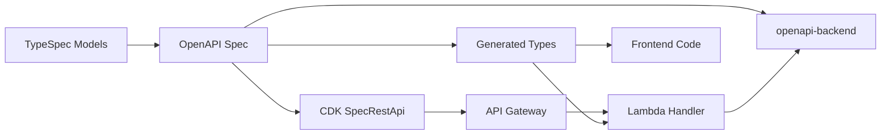

# Architecture Overview

This guide provides an overview of the system architecture, technology stack, and key components.

## Technology Stack

- **Infrastructure**: AWS CDK 2 with TypeScript
- **Backend**: Node.js Lambda with openapi-backend routing
- **Frontend**: React + Vite + TypeScript
- **API Definition**: TypeSpec → OpenAPI 3 + JSON Schema
- **Build System**: npm workspaces monorepo
- **Linting**: Biome

## Key Components

### 1. Infrastructure (CDK) - `src/`

- Self-mutating CodePipeline deploying to multi-account AWS environments
- Organizes as: Pipeline → Stage → Stacks
- See [ADR-003](../ADR/003-Implement_infrastructure_as_code_with_AWS_CDK.md) for CDK decision
- See [ADR-010](../ADR/010-One_infra_pipeline.md) for pipeline strategy

### 2. Backend Lambda - `packages/<backend-package>/`

- Single Lambda handler using openapi-backend for request routing
- AWS API Gateway with aws_proxy integration
- Logging via pino + pino-lambda
- See [ADR-005](../ADR/005-Serverless_backends.md) for serverless decision
- See [ADR-007](../ADR/007-API-First_and_OpenAPI-backend.md) for API-first approach

### 3. Frontend Application - `packages/<frontend-package>/`

- React SPA with functional components
- Cognito authentication
- Deployed to S3 + CloudFront
- See [ADR-017](../ADR/017-S3_CloudFront_frontend_hosting.md)

### 4. API Specifications - `typespec/`

- TypeSpec models and endpoints
- Generates OpenAPI 3 specs
- Shared TypeScript types between frontend and backend
- See [ADR-002](../ADR/002-Model_APIs_using_typespec.md)

## Critical Data Flow

1. TypeSpec compiles to OpenAPI spec (`build/openapi3/openapi.json`)
2. CDK uses spec to create API Gateway REST API (SpecRestApi)
3. All API requests proxy to single Lambda handler
4. openapi-backend routes by `operationId` and validates against spec
5. Generated types shared via npm workspace package

## Multi-Account Deployment

- **Management Account**: Runs CodePipeline for infrastructure deployment
- **Application Accounts**: Host resources (Lambda, API Gateway, DynamoDB, etc.)
- **Self-Mutating Pipeline**: Root stack deploys a CodePipeline that updates itself
- **Triggers**: Git push to configured branch

See [ADR-004](../ADR/004-Apply_multi-account_strategy.md) for multi-account strategy details.

## Database Architecture

- **Single-table design** with DynamoDB
- Uses ElectroDB for entity modeling and queries
- See [ADR-009](../ADR/009-Use_DynamoDB.md) for DynamoDB decision
- See [ADR-008](../ADR/008-Using_id25_as_identifiers.md) for identifier strategy

## Related Documentation

- [RFC 001](../RFC/001_Serverless_Foundation_Template.md) - Complete architecture specification
- [Tooling Reference](./tooling-reference.md) - CDK patterns and TypeSpec workflows
- [Project Structure](./project-structure.md) - Directory organization
