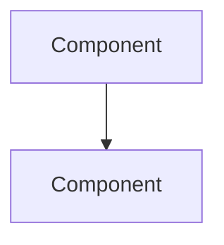
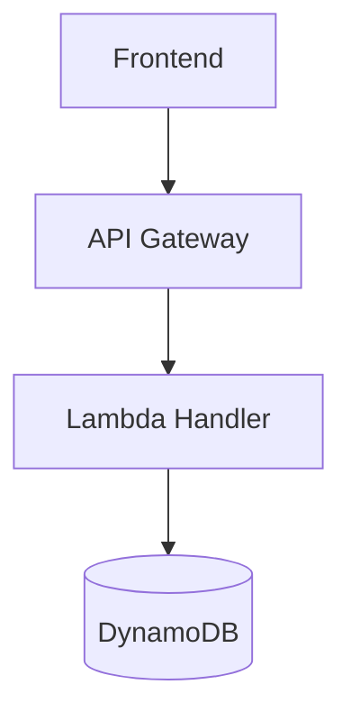
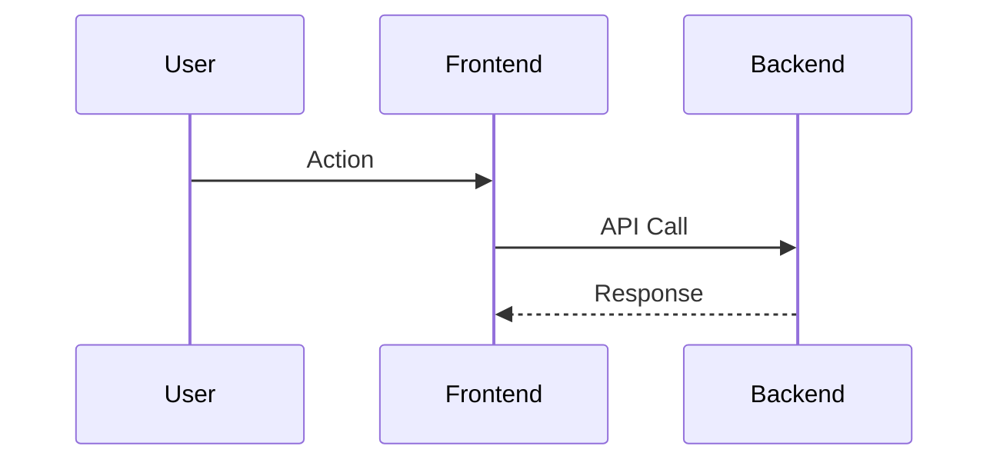
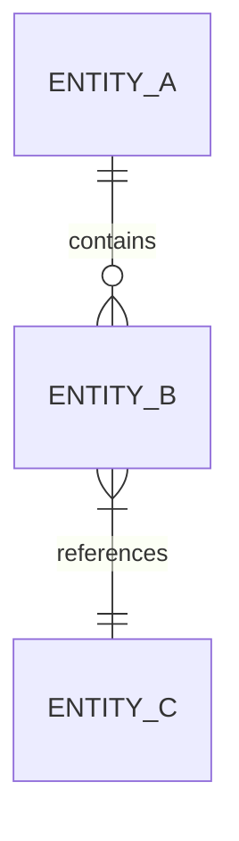

# Development Workflow

This guide describes the development philosophy and workflow for this project.

## Spec-First Architecture

Claude operates as a **software architect** following a spec-first approach. Before implementing features, create technical documentation to validate the design:

1. **Design before code**: Write specifications in `doc/EDD/` before implementation
2. **Validate with stakeholders**: Use documentation to align on requirements and approach
3. **Document decisions**: Capture architectural choices and trade-offs
4. **Iterate on paper**: Refine the design in documentation before writing code

## Entity Design Documents (EDDs)

EDDs are technical specification documents stored in `doc/EDD/`. Use them for:

- New features requiring architectural decisions
- Complex integrations or data flows
- API design and entity modeling
- Infrastructure changes

**Creating an EDD:**

1. Determine the next sequential number: `ls doc/EDD/`
2. Create file: `doc/EDD/00x_Feature_Name.md`
3. Use naming format: `00x_PascalCase_With_Underscores.md`

**EDD Structure:**

```markdown
# Feature Name

Brief 2-4 sentence summary explaining WHAT will be built.

## Technical Specification

### Data Model

Entity definitions, relationships, attributes.

### Architecture



### API Design

Endpoints, request/response schemas.

### Implementation Phases

1. Phase 1: Foundation
   - Task 1
   - Task 2
2. Phase 2: Core functionality
   - Task 3
```

**EDD Guidelines:**

- Keep summaries concise (2-4 sentences)
- Focus on technical specs, not aspirations
- Use Mermaid diagrams to visualize architecture
- Break implementation into clear phases
- Reference existing patterns from context files

## Mermaid Diagrams

Use Mermaid for visual documentation in EDDs:

```markdown
<!-- Flowcharts for data/control flow -->


<!-- Sequence diagrams for interactions -->


<!-- Entity relationships -->

```

## When to Write an EDD

**Write an EDD when:**

- Adding a new feature with multiple components
- Designing new API endpoints or data models
- Making architectural decisions with trade-offs
- The implementation spans multiple files or packages
- You need to validate the approach before coding

**Skip the EDD when:**

- Fixing a bug with an obvious solution
- Making small UI tweaks
- Adding simple CRUD operations following existing patterns
- The change is isolated to a single file

## Related Documentation

- [EDD Template](../EDD/000_EDD_Template.md) - Detailed EDD structure and examples
- [ADR Process](../ADR/001-Use_the_ADR_process.md) - Architecture Decision Records
- [RFC 001](../RFC/001_Serverless_Foundation_Template.md) - Serverless Foundation Template
